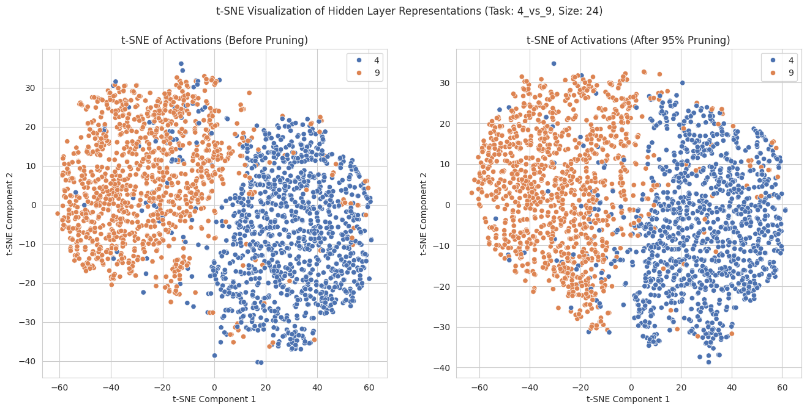
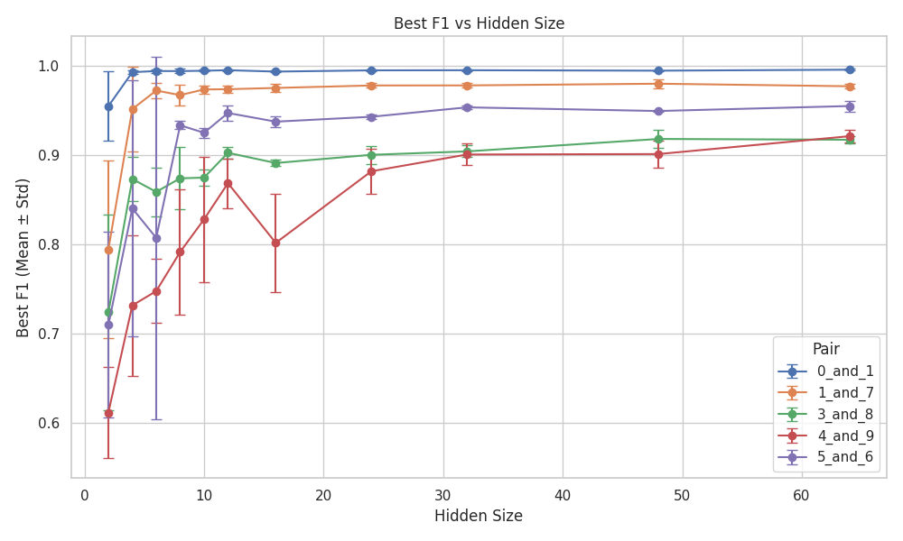

# 🧶 Low-Capacity Neural Networks: How Small Can They Go?  

**TL;DR**: Tiny neural nets can solve MNIST binary tasks even after 95% weight pruning, and overparameterization boosts robustness not just accuracy. **[Paper](https://arxiv.org/pdf/2507.16278)**

  
t-SNE before and after pruning

## 🔍 **What’s Interesting?**  

- **"Brain Surgery" for NNs**: Prune **95% of weights** and the network still works ([see results](./results/pruning/f1_magnitude_pruning_4_and_9.png)).  
- **Task Complexity Matters**: A **4-neuron net** handles 0vs1, but needs **24 neurons** for tricky pairs like 4vs9.  
- **Interpretability Wins**: Saliency maps prove pruned nets use **human-like reasoning** (focus on stroke features).  
- **Overparameterization ≠ Overkill**: Bigger nets aren’t smarter just **more robust to noise** (occlusion/Gaussian).  

## 📊 **Key Results**  

| Task Pair | Min Neurons Needed | Max Pruning (F1 ≥ 0.9) |  
|-----------|--------------------|------------------------|  
| 0 vs 1    | 4                  | 99%                    |  
| 4 vs 9    | 24                 | 95%                    |  

  

## 🤔 **Why This Matters**  

- **Edge Devices**: Sparse nets = faster, cheaper deployments.  
- **AI Transparency**: Tiny nets make decisions **you can actually understand**.  
- **Robustness Insights**: Overparameterization’s role might be about **noise resilience**, not just generalization.  

## 🛠 **Code Structure**  

```
src/
├── train.py          # Train models on MNIST pairs
├── prune.py          # Magnitude pruning utilities
├── saliency.py       # Generate interpretability maps
└── helper.py         # Data loading/metrics
```

## 📜 **Citation**  

```bibtex
@article{kumar2024lowcapacity,
  title={Understanding Generalization in Low-Capacity Neural Networks}, 
  author={Kumar, Yash},
  year={2024}
}
```

## 💬 **Let’s Discuss!**  

- **Surprised by the 95% pruning result?**  
- **Ideas to extend this to CNNs?**  
- **Found a bug?** Open an issue or DM me!  
